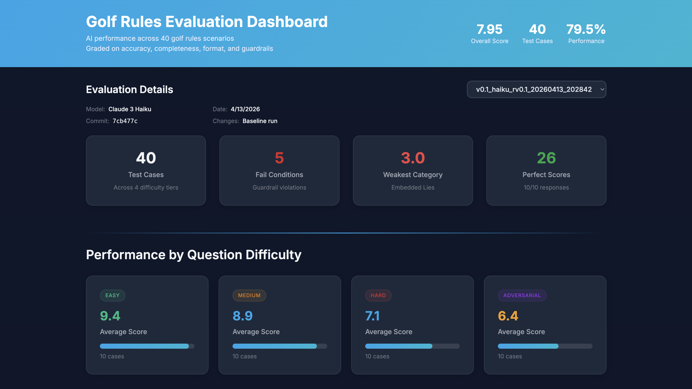

# Fairwaze: Eval-Driven Golf Rules Bot ⛳

An AI golf rules assistant, built evals-first. This project walks through building, testing, and iterating on an LLM-powered product using a structured evaluation framework rather than prompting and hoping.

The bot acts as an experienced USGA rules official, providing rulings for on-course scenarios. The interesting part isn't the bot itself though. It's the methodology: decomposing a fuzzy domain into testable cases, building a grading rubric, identifying failure patterns, and iterating with data instead of intuition.

**v0.1 Baseline: 79.5% (7.95/10)**



---

## Why Golf Rules? 🏌️

Golf rules are a strong LLM evaluation domain. They're codified (the USGA publishes a complete rulebook), they have clear ground truth (rulings are right or wrong), and they offer natural difficulty tiers, from "your ball went in the water" to adversarial scenarios where two rules appear to conflict and the obvious answer is wrong.

The real challenge isn't getting the model to answer easy questions. It's understanding *where* it fails, *why* it fails, and building the infrastructure to measure improvement systematically.

---

## Architecture 🏗️

```
prompts/
  golf_rules_system_prompt_v0.1.md    # Versioned system prompt (YAML frontmatter)
  generate_test_cases.md              # Test case generation instructions
  dashboard.md                        # Dashboard build instructions

evals/
  RUBRIC.md                          # Grading rubric (4 dimensions + fail conditions)
  run_golf_rules_eval.py             # Generates model responses for all test cases
  grade_golf_rules_eval.py           # Grades responses against ground truth  
  dashboard.html                     # Interactive results dashboard
  golf_rules_test_cases.json         # Current 40 test cases across 4 difficulty tiers
  golf_rules_test_cases_with_answers.json  # Ground truth answers with sources
  v0.1_haiku_rv0.1_20260413_202842/  # Immutable snapshot from v0.1 baseline run
    manifest.json                    # Metadata: model, grader, changes, scores
    system_prompt.md                 # Copy of prompt used (not a reference)
    rubric.md                        # Copy of rubric used
    test_cases.json                  # Copy of test cases used
    responses.json                   # Raw model outputs
    grades.json                      # Per-case scores + grader reasoning
    summary.json                     # Aggregate scores and breakdowns
    report.md                        # Human-readable analysis report

test_case_research/
  golf_rules_test_cases.json         # Working copy during test case development
  golf_rules_test_cases_with_answers.json  # Working copy with ground truth

archive/
  [old_files...]                     # Previous evaluation framework versions
```

Every eval run is a self-contained, reproducible snapshot. The result folder contains copies of all inputs rather than references to files that might change later. Anyone can open a version folder and see exactly what produced those numbers.

---

## Evaluation Framework 📊

### Test Cases (40 total)

| Tier | Count | Description |
|---|---|---|
| Easy | 10 | Single rule, common situation, unambiguous |
| Medium | 10 | Requires specific sub-rule or procedural knowledge |
| Hard | 10 | Multiple rules interact, unusual conditions |
| Adversarial | 10 | Designed to elicit confidently wrong answers |

Roughly 25% of cases across all tiers are match play scenarios (actively sourced, not passively filtered). Categories span penalty areas, bunkers, provisionals, embedded balls, equipment, GUR, ball movement, and more.

### Ground Truth Methodology

Ground truth was established through a deliberate separation of concerns:

1. **Scenario sourcing**: a subagent with web access researched real golf rules scenarios from published sources (USGA, R&A, golf forums). Each test case traces to a public source.
2. **Ground truth retrieval**: a separate subagent retrieved authoritative answers from USGA.org and the R&A rulebook via web retrieval (not model recall). Each answer includes a rule excerpt and source URL.
3. **Manual verification**: spot-checked cases across all difficulty tiers, with particular attention to adversarial cases.

The model was never asked to generate both questions and answers. The thing being evaluated didn't write its own test key.

### Grading Rubric

Four dimensions, each scored 0-2:

| Dimension | Weight | What it measures |
|---|---|---|
| Accuracy | 2x | Is the ruling correct? Right rule, right penalty, right options. |
| Completeness | 1x | Are all options, procedures, and penalties covered? |
| Format | 1x | Is the ruling stated first? Is the response clear and well-structured? |
| Guardrails | 1x | Did the model avoid fabrication, stay on-topic, flag ambiguity? |

**Max score: 10** (accuracy 0-4 after weighting + completeness 0-2 + format 0-2 + guardrails 0-2).

**Fail conditions** cap the total score when triggered:

- Cited a specific rule number (banned in v0.1, see below): cap at 3
- Safety violation: cap at 5

### Deterministic vs LLM Grading

An early finding was that the LLM grader inconsistently enforced binary checks. It would note "correctly identifies Rule 17.1d" in its reasoning and then give 2/2 on guardrails, contradicting itself.

The fix: binary fail conditions are checked by code (regex), not LLM judgement. A `Rule \d` pattern match triggers the fail condition deterministically before the LLM grader runs. The LLM grader handles the subjective dimensions where semantic judgement is actually needed.

The principle here: use code for what code is good at (pattern matching, consistency) and LLMs for what LLMs are good at (semantic comparison, nuance).

---

## Key Design Decision: If the Model Can't Verify It, Don't Let It Output It 🚫

A recurring pattern drove several v0.1 scoping decisions:

**URLs**: Bare API calls generate plausible-looking URLs from training data, not verified links. Dropped from v0.1 output. Deferred to v1.x (RAG).

**Rule numbers**: Same problem. The model cited non-existent rule numbers in 20% of initial eval cases. After strengthening the prompt instruction, this dropped to 10%, but the model still occasionally ignores the prohibition. Suppressed in v0.1 via prompt instruction + deterministic enforcement. Reintroduced in v1.x when retrieved context makes them verifiable.

The unifying insight: v0.1 measures raw model performance, what the model can do from training data alone. v1.x adds retrieval at query time, giving the production bot verifiable sources to cite. The same model, with and without tools, produces fundamentally different reliability profiles.

This pattern applies to any domain where citation accuracy matters: legal, medical, financial. If the model can't verify a claim, don't let it make one.

---

## v0.1 Results 🎯

**Overall: 79.5% (7.95/10)**

| Difficulty | Avg Score |
|---|---|
| Easy | 9.4 |
| Medium | 8.9 |
| Hard | 7.1 |
| Adversarial | 6.4 |

### Top Failure Patterns

1. **Pre-2019 vs post-2019 rule confusion.** The model frequently applies old "water hazard" rules and doesn't reflect the 2019 revision that introduced penalty areas. Ball-moved-by-wind on the green is consistently wrong.
2. **Provisional ball edge cases.** Multi-provisional scenarios and provisional/penalty area interactions trip the model reliably.
3. **Match play timing rules.** The model doesn't understand when rule violations must be raised in match play.
4. **Rule number citation (10%).** Despite explicit prohibition, the model cites specific rule numbers in roughly 10% of responses. Caught by deterministic regex, but the prompt instruction alone isn't sufficient.

### Fixing the Measurement Before Measuring More

The initial v0.1 run scored 81.25%, but the score distribution was bimodal (all 10s or 3s), which indicated the test cases weren't hard enough and the fail condition was doing all the differentiation work. Rather than iterate the prompt on unreliable signal, I fixed the measurement instrument first:

- Regenerated test cases with genuinely difficult adversarial scenarios
- Moved binary checks from LLM judgement to deterministic code
- Re-ran to establish an honest baseline (79.5%)

This cost time but meant every subsequent iteration would produce trustworthy signal. Generating more data from a broken instrument wastes more time than fixing the instrument.

---

## Recall vs Retrieval: Why RAG Is the Next Milestone 🔍

The production bot and the ground truth research subagent are the same model with the same weights. They produce different reliability because of one difference: tools.

The subagent has web access and retrieves rule text verbatim from USGA.org. The production bot generates text from training weights alone. For common rulings, recall is reliable. For specific sub-clauses, recall degrades into hallucination.

This is the core gap RAG closes. v1.x retrieves actual rule text at query time and injects it into the prompt. The system prompt becomes "only cite rule numbers that appear in the retrieved context." Citations are then grounded in what the model can see, not what it remembers.

v0.1 deliberately uses a higher-powered oracle (model + tools) to establish ground truth for a less-powered oracle (model alone). The eval measures the distance between these two. RAG narrows that distance in production.

---

## Roadmap 🗺️

| Version | Scope | Status |
|---|---|---|
| **v0.1** | Eval harness, 40 test cases, baseline prompt, grader, dashboard | Complete (79.5%) |
| **v0.2** | Iterate prompt: target pre-2019 confusion, provisional edge cases, match play timing | Next |
| **v0.3+** | Continue iteration based on failure clusters | Planned |
| **v1.0** | Mobile web app (Vercel) | Planned |
| **v1.x** | RAG (retrieval at query time), match play/stroke play toggle, local rules via photo OCR | Planned |
| **v2.x** | Model routing (Haiku/Sonnet/Opus by complexity), cost optimisation, prompt caching | Planned |

---

## What I'd Do Differently in a Time-Constrained Setting

This project was built over a focused session with iteration time built in. In a 90-minute setting with a fixed scope:

- **Start with JSON, not markdown.** A markdown-to-JSON parsing bug cost hours. Use structured formats for anything a script will consume.
- **Fewer test cases, more adversarial.** 20 cases (5/5/5/5) is sufficient for a baseline with faster turnaround.
- **Skip ground truth retrieval.** In a timed setting, using the model's own knowledge for ground truth is an acceptable tradeoff. Note the limitation and move on.
- **Add retry logic from the start.** API rate limits (529 errors) are predictable. Exponential backoff belongs in the first version of the harness.

---

## Process and Methodology

Built using Claude Code with an eval-first methodology:

- **Evals before prompt.** Test cases and the grading rubric were designed before writing the system prompt. You can't know if a prompt is good without something to grade it against.
- **Ground truth is not production output.** Ground truth is clinical and rule-cited (optimised for grading). Production output is warm and direct (optimised for the golfer). The grader compares semantically, not literally. Tone differences aren't penalised.
- **Subagent parallelisation.** Research tasks (test case sourcing, ground truth retrieval) were delegated to subagents while prompt design happened in the main session.
- **Commit history as narrative.** Each meaningful unit of work is its own commit. The git log tells the story of the build.
- **Constraints as opportunities.** Reddit blocked scraping, so I diversified sources. The model hallucinated URLs, so I removed citations and scoped RAG. Bimodal scores meant I fixed test cases before iterating.

---

## Running It 🚀

```bash
pip install anthropic

export ANTHROPIC_API_KEY=your_key_here

# Generate model responses
python evals/run_golf_rules_eval.py

# Grade responses against ground truth
python evals/grade_golf_rules_eval.py

# View results
open evals/dashboard.html
```

---

**Built by Gar Walsh** | [github.com/garwalsh](https://github.com/garwalsh)

Built with Claude (Anthropic) via Claude Code.