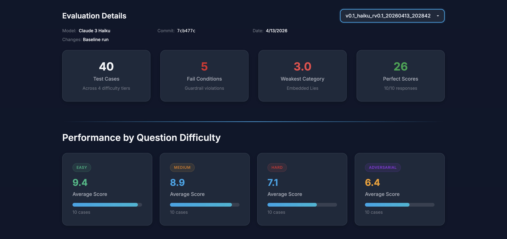

# v0.1 Eval Analysis — Revised Infrastructure

**Version:** v0.1 (revised infrastructure) | **Date:** 2026-04-13 | **Model:** Claude Sonnet (via Anthropic API) | **Score:** 79.5%

**Changes from initial run:** Regenerated all 40 test cases with harder adversarial tier and clearer difficulty gaps. Suppressed rule number citations in system prompt. Added deterministic regex check for rule number citations (moved from LLM judgment to code). Replaced "Hallucinated Rule Number" fail condition with "Cited Rule Number" guardrail check.

## Summary

Revised baseline evaluation after fixing eval infrastructure: harder test cases (especially adversarial), suppressed rule numbers in system prompt, deterministic fail condition checks. 40 test cases (10 easy, 10 medium, 10 hard, 10 adversarial). Overall average score: **7.95 / 10 (79.5%)**. Max possible score is 10, calculated as accuracy (weighted 2x) + completeness + format + guardrails, each scored 0-2.

Compared to the initial v0.1 run (81.25%), the revised score is lower and more honest. The prior run was inflated by insufficiently difficult test cases and a bimodal score distribution.

## Difficulty Breakdown

| Difficulty | Avg Score | Count |
|---|---|---|
| Easy | 9.4 | 10 |
| Medium | 8.9 | 10 |
| Hard | 7.1 | 10 |
| Adversarial | 6.4 | 10 |

Clear staircase pattern validates that the difficulty tiers are now appropriately calibrated. The 3-point gap between easy (9.4) and adversarial (6.4) provides meaningful signal for iteration.

## Score Distribution

| Score | Count |
|---|---|
| 10 | 24 |
| 7 | 2 |
| 6 | 2 |
| 5 | 3 |
| 4 | 2 |
| 3 | 7 |

Distribution is no longer bimodal. Partial scores (4-7 range) now exist, confirming the rubric is differentiating between "close but flawed" and "completely wrong." The 7 scores of 3 include both fail-condition caps and genuinely poor responses.

## Fail Conditions

- **Cited Rule Number: 4 / 40 (10%)** — down from 8/40 (20%) in the initial run after strengthening the system prompt instruction. Deterministic regex check is catching these consistently, even when the LLM grader's reasoning says "perfect response" (e.g., test_037).
- Safety Violation: 1 (test_036 — incorrect ruling on late challenge in match play)

The reduction from 20% to 10% on rule number citations confirms the system prompt change had partial effect. Further iteration needed.

## Weakest Categories

| Category | Avg Score | Cases |
|---|---|---|
| preferred_lies | 3.0 | 1 |
| penalty_area (adversarial) | 3.0 | 1 |
| ball_moved | 3.0 | 2 |
| ball_in_motion | 4.0 | 1 |
| unplayable (adversarial) | 3.0 | 1 |
| provisional (hard) | 5.0 | 1 |
| match_play (adversarial) | 5.0 | 1 |

## Strongest Categories

| Category | Avg Score | Cases |
|---|---|---|
| relief | 10.0 | 2 |
| putting_green | 10.0 | 1 |
| flagstick | 10.0 | 1 |
| lost_ball | 10.0 | 1 |
| OB | 10.0 | 1 |
| caddie (if present) | 10.0 | 1 |
| obstruction | 10.0 | 2 |
| dropping | 10.0 | 2 |
| GUR | 10.0 | 2 |
| equipment | 10.0 | 1 |
| bunker | 10.0 | 2 |

## Key Failure Patterns

**1. Model still cites rule numbers (4 cases).** Despite explicit instruction not to, the model cites rule numbers in ~10% of responses. The deterministic regex check catches these reliably. Further prompt strengthening or post-processing (strip rule numbers from output) could address this.

**2. Ball moved by natural forces (test_022).** Model incorrectly states the ball can be replaced on the green after wind moves it to a bunker. This is a known common misconception — the rule changed in 2019 and the model may be recalling pre-2019 rules.

**3. Penalty area rules confusion (test_031, test_039).** Model applies old "water hazard" rules (no grounding) and incorrectly allows unplayable ball relief in penalty areas. Both suggest the model conflates pre-2019 and post-2019 rules.

**4. Provisional ball edge cases (test_021).** Model incorrectly states a second provisional is invalid when the first provisional is in a penalty area. This is a nuanced multi-rule interaction the model doesn't handle well.

**5. Late challenges in match play (test_036).** Model doesn't understand the timing rules for raising rule violations in match play. This is an obscure but important area.

## Infrastructure Improvements Validated

- **Harder test cases** produced a more honest baseline (79.5% vs 81.25%) with better signal.
- **Deterministic fail condition checks** eliminated grader inconsistency (previously the LLM grader caught rule citations only 6/34 times; now caught 4/4 times by regex).
- **Score distribution** shifted from bimodal (all 10s or 3s) to a healthy spread with meaningful partial scores.
- **Difficulty staircase** now shows a clear 3-point gradient from easy to adversarial.

## Recommended Actions for v0.2

1. **Target pre-2019 vs post-2019 rule confusion.** Add explicit guidance in the system prompt about rules that changed in the 2019 revision: penalty area grounding, ball moved by natural forces on the green, etc.
2. **Strengthen rule number suppression.** Consider post-processing to strip any "Rule X.X" patterns from output, in addition to the prompt instruction.
3. **Add provisional ball guidance.** The system prompt should explicitly address multi-provisional scenarios and the interaction between provisionals and penalty areas.
4. **Add match play timing rules.** Explicit guidance on when rule violations must be raised in match play.