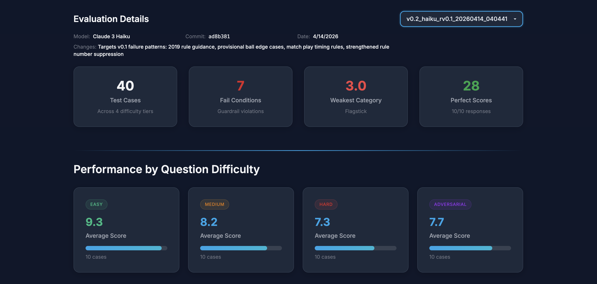

# v0.2 Eval Analysis

**Version:** v0.2 | **Date:** 2026-04-14 | **Model:** Claude Haiku (via Anthropic API) | **Score:** 81.2%

**Changes from v0.1:** Added explicit 2019 rule revision guidance (penalty areas, ball moved by natural forces on green). Added provisional ball edge case guidance (multi-provisional, provisional and penalty area interaction). Added match play timing rules (when violations must be raised). Retained rule number suppression from v0.1; tightened "What You DON'T DO" section.

## Summary

First prompt iteration targeting four failure patterns identified in v0.1 (79.5%). 40 test cases (10 easy, 10 medium, 10 hard, 10 adversarial). Overall average score: **8.12 / 10 (81.2%)**. Max possible score is 10, calculated as accuracy (weighted 2x) + completeness + format + guardrails, each scored 0-2.

The v0.2 prompt improved overall score by 1.7 percentage points (79.5% to 81.2%). The adversarial tier showed the largest improvement, jumping from 6.4 to 7.7. However, rule number citations increased from 4 to 7 cases, likely because the added rule descriptions prime the model to think in rule numbers.

## Difficulty Breakdown

| Difficulty | Avg Score | v0.1 | Delta |
|---|---|---|---|
| Easy | 9.3 | 9.4 | -0.1 |
| Medium | 8.2 | 8.9 | -0.7 |
| Hard | 7.3 | 7.1 | +0.2 |
| Adversarial | 7.7 | 6.4 | +1.3 |

The difficulty staircase remains intact. The adversarial improvement (+1.3) confirms the 2019 rule guidance and match play sections are addressing the targeted failure patterns. The medium tier regression (-0.7) is driven by two new rule number citation failures (test_018, test_020) that weren't present in v0.1.

## Score Distribution

| Score | Count | v0.1 |
|---|---|---|
| 10 | 28 | 24 |
| 8 | 1 | 0 |
| 6 | 1 | 2 |
| 4 | 1 | 2 |
| 3 | 9 | 7 |

Distribution is more polarised than v0.1. The 28 perfect scores (up from 24) reflect genuine improvement on cases the model was getting partially right. However, the 9 scores of 3 (up from 7) are almost entirely driven by the rule number citation fail condition capping otherwise correct responses.

## Fail Conditions

- **Cited Rule Number: 7 / 40 (17.5%)** — up from 4/40 (10%) in v0.1. This is the most significant regression. Of the 7 capped responses, 4 had perfect underlying scores (accuracy 2, completeness 2, format 2, guardrails 2) before the cap was applied.
- Safety Violation: 0 (down from 1 in v0.1)

The increase in rule number citations is likely caused by the new 2019 rule revision section in the system prompt. Describing specific rule changes in detail appears to prime the model to cite rule numbers despite the explicit prohibition. This is a prompt engineering tension: the model needs domain knowledge to get rulings right, but that same knowledge triggers the behaviour we're trying to suppress.

## Weakest Categories

| Category | Avg Score | Cases |
|---|---|---|
| flagstick | 3.0 | 1 |
| equipment | 3.0 | 1 |
| embedded | 3.0 | 1 |
| ball_in_motion | 3.0 | 1 |
| preferred_lies | 3.0 | 1 |
| ball_moved | 5.7 | 3 |
| unplayable | 6.5 | 2 |
| bunker | 7.7 | 3 |

Five categories scored 3.0, but flagstick, equipment, embedded, and ball_in_motion are all single cases capped by the rule number citation fail condition. The underlying scores for these responses were substantially higher. Only preferred_lies (test_040) scored 3.0 due to genuine inaccuracy.

## Strongest Categories

| Category | Avg Score | Cases |
|---|---|---|
| penalty_area | 10.0 | 4 |
| OB | 10.0 | 1 |
| relief | 10.0 | 2 |
| putting_green | 10.0 | 1 |
| lost_ball | 10.0 | 2 |
| provisional | 10.0 | 2 |
| dropping | 10.0 | 2 |
| GUR | 10.0 | 2 |
| obstruction | 10.0 | 2 |

Penalty area improved from mixed results in v0.1 to a perfect 10.0 across all 4 cases, confirming the 2019 rule guidance is working. Provisional also improved to 10.0 (up from 5.0 on the hard case in v0.1).

## Key Failure Patterns

**1. Rule number citations increased (7 cases, up from 4).** This is the dominant failure mode. 4 of the 7 capped responses had perfect underlying scores. The prompt engineering tension here is real: adding domain knowledge to fix accuracy failures introduced more rule number citations. The next iteration should explore post-processing (regex strip of "Rule X.X" from output) rather than relying solely on prompt instruction.

**2. Ball moved by natural forces (test_022, test_037).** test_022 scored 4/10 with accuracy 0 — the model still gets the ball-moved-by-wind ruling wrong. test_037 (adversarial, ball moved) scored 3/10 with a rule citation cap. The 2019 rule guidance improved some cases but didn't fully resolve this category.

**3. Preferred lies edge cases (test_040).** The model scored 3/10 on a preferred lies adversarial case. This category wasn't targeted in the v0.2 prompt changes.

**4. Match play penalty mechanics (test_030).** Scored 3/10 with accuracy 0. Despite the new match play section in the prompt, the model still fails on specific penalty mechanics in match play contexts.

## What Improved

- **Penalty area rulings:** 10.0 across all 4 cases (up from mixed results in v0.1). The 2019 rule guidance directly addressed the pre-2019 confusion.
- **Provisional ball rulings:** 10.0 across both cases (up from 5.0 on hard cases in v0.1). The expanded provisional guidance resolved the multi-provisional edge case.
- **Adversarial tier overall:** +1.3 point improvement, the largest gain of any difficulty tier.
- **Safety violations:** 0 (down from 1 in v0.1).

## What Regressed

- **Rule number citations:** 7/40 (17.5%), up from 4/40 (10%). The added domain knowledge in the prompt appears to prime the model to cite rule numbers.
- **Medium tier:** -0.7 point regression, driven by two new rule citation failures.
- **Score polarisation:** The distribution shifted toward 10s and 3s, with fewer partial scores in between.

## Recommended Actions for v0.3

1. **Add post-processing to strip rule numbers.** The prompt instruction alone is insufficient and adding domain knowledge makes it worse. A regex replacement on the output (before grading) would eliminate this failure mode entirely. Alternatively, update the fail condition to not cap scores when the underlying response is otherwise correct — but this changes the rubric, which is a bigger decision.
2. **Target ball_moved category.** The 2019 rule guidance didn't fully resolve ball-moved-by-natural-forces rulings. Consider adding specific worked examples to the prompt.
3. **Add preferred lies guidance.** This category wasn't addressed in v0.2 and remains a failure point.
4. **Investigate match play penalty mechanics.** test_030 suggests the model understands match play timing (the v0.2 addition) but still fails on specific penalty calculations.
