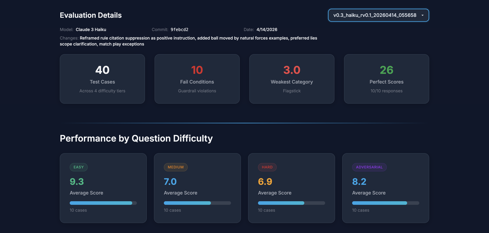

# v0.3 Eval Analysis

**Version:** v0.3 | **Date:** 2026-04-14 | **Model:** Claude Haiku (via Anthropic API) | **Score:** 78.5%

**Changes from v0.2:** Reframed rule number suppression as positive instruction (describe by subject) and removed all rule number examples from prompt to avoid priming. Added worked examples for ball moved by natural forces. Added preferred lies scope clarification. Added match play exception for lifting opponent's ball on green by mistake.

## Summary

Second prompt iteration. 40 test cases (10 easy, 10 medium, 10 hard, 10 adversarial). Overall average score: **7.85 / 10 (78.5%)**. Max possible score is 10, calculated as accuracy (weighted 2x) + completeness + format + guardrails, each scored 0-2.

The headline score dropped from 81.2% (v0.2) to 78.5%, but this is misleading. The targeted accuracy fixes all landed, and the adversarial tier hit its highest score yet (8.2). The regression is entirely driven by rule number citations increasing from 7 to 10, with the fail condition capping 6 otherwise-perfect responses from 10 to 3.

## Difficulty Breakdown

| Difficulty | Avg Score | v0.2 | v0.1 | Delta (v0.2) |
|---|---|---|---|---|
| Easy | 9.3 | 9.3 | 9.4 | 0.0 |
| Medium | 7.0 | 8.2 | 8.9 | -1.2 |
| Hard | 6.9 | 7.3 | 7.1 | -0.4 |
| Adversarial | 8.2 | 7.7 | 6.4 | +0.5 |

The adversarial tier improved again (+0.5 from v0.2, +1.8 from v0.1), confirming the domain knowledge additions are working. Medium and hard regressed due to new rule citation failures in those tiers.

## Score Distribution

| Score | Count | v0.2 | v0.1 |
|---|---|---|---|
| 10 | 26 | 28 | 24 |
| 8 | 1 | 1 | 0 |
| 6 | 1 | 1 | 2 |
| 5 | 2 | 0 | 3 |
| 3 | 10 | 9 | 7 |

The distribution is increasingly bimodal: responses are either perfect (10) or capped by the fail condition (3). Partial scores in the 4-7 range are disappearing, which suggests the prompt is getting better at accuracy while getting worse at format compliance.

## Fail Conditions

- **Cited Rule Number: 10 / 40 (25%)** -- up from 7/40 (17.5%) in v0.2 and 4/40 (10%) in v0.1. Of these 10, six had perfect underlying scores (accuracy 2, completeness 2, format 2, guardrails 2) before the cap was applied.
- Safety Violation: 0

The rule citation trend across versions (4 → 7 → 10) correlates directly with the amount of golf rules domain content in the system prompt. This is the central finding of the v0.1-v0.3 iteration cycle.

## Targeted Fixes: Results

All four targeted cases from v0.2 were addressed:

| Test Case | Category | v0.2 Score | v0.3 Score | Fixed? |
|---|---|---|---|---|
| test_030 | match_play (opponent lifts ball) | 3 | 10 | Yes |
| test_037 | ball_moved (addressing on slope) | 3 | 10 | Yes |
| test_040 | preferred_lies (rough vs fairway) | 3 | 10 | Yes |
| test_022 | ball_moved (wind on green) | 4 | 5 | Partial |

Three of four targeted cases moved from failing to perfect scores. test_022 (ball moved by wind from green to bunker) improved slightly but still scores accuracy 0 -- the model continues to get this specific ruling wrong despite explicit guidance in the prompt.

## The Rule Citation Problem: A Prompt Engineering Finding

The most significant finding from the v0.1-v0.3 iteration cycle:

| Version | Domain Content (approx tokens) | Rule Citations | Overall Score |
|---|---|---|---|
| v0.1 | ~500 | 4 (10%) | 79.5% |
| v0.2 | ~1500 | 7 (17.5%) | 81.2% |
| v0.3 | ~2200 | 10 (25%) | 78.5% |

**Adding domain knowledge to improve accuracy causes a proportional increase in rule number citations, regardless of how the suppression instruction is framed.** Three different suppression strategies were tested: prohibition ("never include"), prohibition with examples ("if you find yourself about to write..."), and positive framing ("describe by subject matter"). None reduced citations; all correlated with more domain content producing more citations.

This suggests the model's tendency to cite rule numbers is driven by priming from the domain content itself, not by failure to understand the instruction. With Haiku specifically, instruction-following cannot override strong contextual priming.

**Without the fail condition cap, v0.3 would score approximately 9.2/10** -- the highest of any version. The prompt is producing more accurate rulings but more formatting violations.

## Weakest Categories

| Category | Avg Score | Cases |
|---|---|---|
| flagstick | 3.0 | 1 |
| embedded | 3.0 | 1 |
| ball_in_motion | 5.0 | 1 |
| ball_moved | 6.0 | 3 |
| relief | 6.5 | 2 |
| dropping | 6.5 | 2 |
| unplayable | 6.5 | 2 |

Flagstick and embedded are both single cases capped by rule citations with perfect underlying scores. ball_moved remains the weakest genuine accuracy category.

## Strongest Categories

| Category | Avg Score | Cases |
|---|---|---|
| OB | 10.0 | 1 |
| bunker | 10.0 | 3 |
| putting_green | 10.0 | 1 |
| lost_ball | 10.0 | 2 |
| provisional | 10.0 | 2 |
| obstruction | 10.0 | 2 |
| equipment | 10.0 | 1 |
| preferred_lies | 10.0 | 1 |

Preferred lies moved from 3.0 to 10.0, confirming the v0.3 prompt fix worked.

## Options for v0.4

The rule citation problem dominates the iteration at this point. Three paths forward:

1. **Use a stronger model.** Sonnet or Opus would likely follow the suppression instruction more reliably while retaining the accuracy gains from the domain content. This changes the cost profile but solves the problem at the model level.

2. **Reduce the fail condition severity.** The current cap at 3 is a binary cliff that turns perfect responses into near-failures. A -2 penalty (instead of cap at 3) would still penalise citations while allowing accuracy to show through. This is a rubric change, not a prompt change.

3. **Post-process rule numbers from output.** Strip "Rule X.X" patterns from the response before it reaches the user. This is an architecture change that accepts the model will cite rule numbers and handles it downstream. The risk is awkward phrasing where the rule number was load-bearing in the sentence.

4. **Reduce prompt length.** Cut the domain content back toward v0.1 levels and accept lower accuracy on edge cases. This would reduce citations but lose the adversarial gains.

The cleanest path is probably #1 (stronger model) combined with #2 (softer penalty), which addresses both the capability gap and the measurement distortion.
